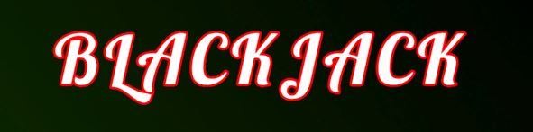

<h1 align="center">
  
</h1>

**- [Pulsa aquí para la versión en español.](README.md)**
 
 

Blackjack simulator, developed without a betting system. Simply for a few quick games.

## Project build

The project is created using Unity 2021.3.5f1.

Just clone the repository or copy the files contained in it and open the project with Unity. The necessary resources will be installed automatically.

Once inside the Unity editor, the project can be modified and compiled.

## Game instructions

To navigate through the menus, you can use mouse.

The objective of the game is to add 21 with the cards in your hand, or to get as close as possible without going overboard. Initially you will receive two cards, and you can request as many as you need by clicking on the "Continue" button. When you are satisfied with the cards in your hand, press "Stand Up".

Now the computer's turn will begin. He will receive cards until he draws a number greater than 21 (you win the game), he draws a number greater than yours and not greater than 21 (you lose the game), or he draws a number equal to yours and decides not to continue playing (you draw) .

If your two starting cards add up to 21, you automatically win the game. All the cards add their value except J, Q and K (add 10 points) and A (add one point or 11 points, the higher score prevailing as long as it is not higher than 21).

## Game download

Currently, this version of the application can be downloaded from the following sites.

<a href="https://sergiomejias.itch.io/blackjack">
<a href="https://gamejolt.com/games/blackjack/737274">
<a href="https://play.google.com/store/apps/details?id=com.SergioMejias.Blackjack">
<a href="https://galaxy.store/jhkyrayxq">